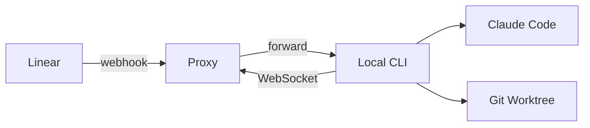

# Sniff - Local-First AI Agents for Linear

> Declarative AI agents that run on your machine. Like Docker Compose for AI agents.

Deploy AI agents with a simple YAML config. Code execution stays local, only webhook routing goes through the cloud.

## Architecture



- **Local-first**: Agents run on your machine with full codebase access
- **Isolated execution**: Each issue gets its own git worktree
- **Linear Agents API**: Native integration with Linear's agent platform
- **No database**: Config from YAML, tokens stored locally in `~/.sniff/`

## Quick Start

```bash
# Install Bun if you haven't
curl -fsSL https://bun.sh/install | bash

# Clone and install
git clone https://github.com/caiopizzol/sniff
cd sniff
bun install

# Initialize config
bun run apps/cli/src/index.ts init

# Authenticate with Linear
bun run apps/cli/src/index.ts auth linear

# Start the agent
bun run apps/cli/src/index.ts start
```

## Configuration

**sniff.yml** - Agent definitions (commit to git):

```yaml
version: "2.0"

agents:
  - id: triage-agent
    name: Triage Agent
    label: triage # Triggered when this label is applied
    systemPrompt: |
      You are a triage agent. When assigned an issue:
      1. Analyze the issue description
      2. Explore the codebase for context
      3. Suggest next steps or solutions
    runner:
      claude:
        allowedTools:
          - Read
          - Glob
          - Grep
```

## CLI Commands

```bash
sniff init              # Create sniff.yml
sniff validate          # Validate configuration
sniff auth linear       # Authenticate with Linear (OAuth)
sniff start             # Start local agent server
sniff stop              # Stop running agent
sniff status            # Show agent status
sniff logs              # View execution logs
```

## How It Works

1. **CLI connects** → WebSocket connection to cloud proxy
2. **Linear webhook fires** → Issue assigned to agent or label applied
3. **Proxy forwards** → Routes webhook to your CLI via WebSocket
4. **Worktree created** → Git worktree for isolated execution
5. **Claude executes** → Runs with your system prompt and tool restrictions
6. **Results posted** → Agent response appears in Linear

## Project Structure

```
sniff/
├── apps/
│   ├── cli/              # CLI application
│   ├── proxy/            # Cloudflare Worker
│   ├── web/              # Web application
│   └── docs/             # Documentation site
├── packages/
│   ├── core/             # Shared types, env config, logger
│   ├── config/           # Zod schemas, YAML loading
│   ├── connection/       # WebSocket CLI-proxy communication
│   ├── linear/           # Webhook parsing, API client
│   ├── orchestrator/     # Server, worktree manager
│   ├── runner-claude/    # Claude Code SDK wrapper
│   └── storage/          # Filesystem storage (~/.sniff/)
└── sniff.yml             # Your agent configuration
```

## Environment Variables

All environment variables are optional with sensible defaults:

| Variable                | Default                    | Description                    |
| ----------------------- | -------------------------- | ------------------------------ |
| `SNIFF_PROXY_URL`       | `https://proxy.sniff.to`   | Proxy URL for webhooks         |
| `SNIFF_PORT`            | `3847`                     | Local server port              |
| `LINEAR_WEBHOOK_SECRET` | -                          | Webhook signature verification |

Tokens are stored locally in `~/.sniff/tokens/` after running `sniff auth`.

## Development

```bash
# Install dependencies
bun install

# Run CLI in development
bun run apps/cli/src/index.ts [command]

# Type check
bun run typecheck

# Lint
bun run lint

# Run tests
bun test
```

## Self-Hosted Proxy (Optional)

By default, Sniff uses `https://proxy.sniff.to`. To run your own proxy:

```bash
cd apps/proxy
bunx wrangler deploy
```

Then set `SNIFF_PROXY_URL=https://your-proxy.workers.dev` and configure Linear webhooks to point to `https://your-proxy.workers.dev/webhook/linear`.

## License

MIT

## Support

- **Issues**: [github.com/caiopizzol/sniff/issues](https://github.com/caiopizzol/sniff/issues)
- **Discord**: [discord.gg/huk9sSQCJA](https://discord.gg/huk9sSQCJA)
