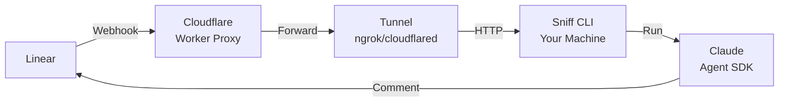
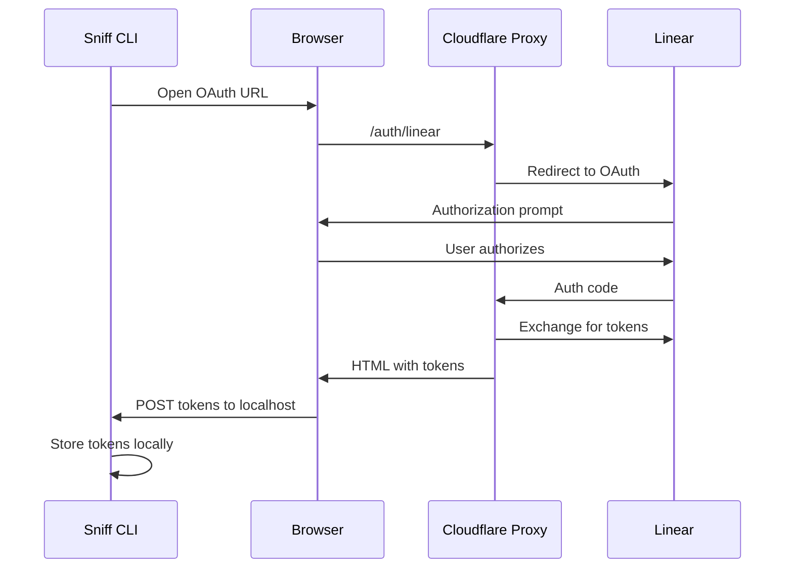

# How It Works

Sniff connects Linear to Claude Agent SDK through a proxy and webhook system. When something happens in Linear, your agent analyzes it and responds with full access to your codebase.

## Architecture



### Components

| Component            | Role                                                             |
| -------------------- | ---------------------------------------------------------------- |
| **Linear**           | Sends webhooks when agent assigned or mentioned                  |
| **Proxy**            | Cloudflare Worker that handles OAuth and forwards webhooks       |
| **Tunnel**           | ngrok or cloudflared that exposes your local CLI to the internet |
| **Sniff CLI**        | Local server that receives webhooks and runs agents              |
| **Claude Agent SDK** | Executes agents with tools (Read, Write, Edit, Bash, etc.)       |

## OAuth Flow

Authentication happens via OAuth through your proxy:



Tokens are stored in `~/.sniff/tokens/` and automatically refreshed when expired.

## Agent Triggering

Agents can be triggered in several ways:

### 1. Issue Delegation

Assign an issue to the Sniff application via Linear's assignment feature. The agent starts working immediately.

### 2. @Mention in Comments

Users can @mention the agent in any issue comment to trigger it directly.

### 3. Label or Team Filtering

Optionally restrict which issues an agent handles using `label` and/or `team`:

```yaml
agents:
  - id: engineer
    label: agent # Only issues with this label
    team: TEAM_ID # Only issues in this team
```

Both fields are optional. If omitted, the agent responds to any delegation or @mention.

## The Agent Lifecycle

### 1. Webhook Received

Linear sends a webhook to your proxy when an issue matches trigger criteria:

```json
{
  "type": "AgentSessionEvent",
  "action": "created",
  "createdAt": "2025-11-01T00:00:00.000Z",
  "agentSession": {
    "id": "abc-123",
    "issue": {
      "title": "Fix login button",
      "description": "The login button is unresponsive...",
      "labels": [{ "name": "agent" }]
    }
  }
}
```

### 2. Webhook Forwarded

The proxy verifies the signature (if configured) and forwards to your local CLI via the tunnel.

### 3. Agent Selected

The CLI matches the event to your configured agent(s) by:

- Checking if the issue was delegated to the agent
- Checking if the agent was @mentioned
- Filtering by `label` and `team` if configured

### 4. Worktree Created

If `SNIFF_WORKTREE_ENABLED=true` (default), a git worktree is created for isolated execution:

```
.git/worktrees/sniff-abc-123/
```

This prevents agents from interfering with each other or your working directory.

### 5. Agent Executes

Claude Agent SDK runs with your configuration:

- System prompt from `systemPrompt`
- Tools from `allowedTools`
- MCP servers from `mcpServers`
- Limits from `maxTurns`, `maxBudgetUsd`

The agent can:

- **Read files** - Understand your codebase
- **Write/Edit files** - Make changes
- **Run commands** - Execute builds, tests, git operations
- **Search code** - Find relevant files and patterns
- **Spawn sub-agents** - Delegate complex tasks

### 6. Progress Updates

As the agent works, progress is streamed to Linear as comment updates:

| Update Type   | Description                                |
| ------------- | ------------------------------------------ |
| **Thought**   | Agent's reasoning and plans                |
| **Action**    | Significant operations (Edit, Write, Task) |
| **Ephemeral** | Routine exploration (Read, Glob, Grep)     |

### 7. Response Posted

The final result is posted as a Linear comment with the agent's work summary.

## What Agents Can Access

When processing an issue, your agent receives:

- **Issue context** - Title, description, labels, priority
- **Assignee and creator** - Who created and is assigned to the issue
- **Team and project** - Organizational context
- **Recent comments** - Discussion history
- **Attachments** - Links and files attached to the issue

Plus full access to your codebase via Claude Agent SDK tools.

## Git Worktree Isolation

Each agent run gets an isolated git worktree:

```
main branch (your work)
├── .git/worktrees/
│   ├── sniff-issue-123/  ← Agent's isolated environment
│   └── sniff-issue-456/  ← Another agent's environment
```

Benefits:

- Agents don't interfere with your working directory
- Multiple agents can run in parallel
- Failed runs don't leave your repo dirty
- Easy cleanup after agent completes

Disable with `SNIFF_WORKTREE_ENABLED=false` if needed.

## Multiple Agents

Define multiple agents with different triggers and capabilities:

```yaml
version: "2.0"

agents:
  - id: engineer
    label: agent
    systemPrompt: |
      You are a software engineer...
    runner:
      claude:
        allowedTools: [Read, Write, Edit, Bash]
        permissionMode: acceptEdits

  - id: reviewer
    label: review
    systemPrompt: |
      You are a code reviewer...
    runner:
      claude:
        allowedTools: [Read, Glob, Grep]
        permissionMode: default
```

Each agent has its own:

- Trigger label
- System prompt
- Tool permissions
- Execution limits

## Proxy Architecture

The Cloudflare Worker proxy handles:

### OAuth Endpoints

- `GET /auth/linear` - Start OAuth flow
- `GET /auth/linear/callback` - Receive OAuth code, exchange for tokens
- `POST /auth/linear/refresh` - Refresh expired tokens

### Webhook Forwarding

- `POST /webhook/linear` - Receive Linear webhook, forward to tunnel URL

### Health Check

- `GET /` or `GET /health` - Returns "OK"

The proxy is stateless - it stores no data. Secrets (OAuth credentials, tunnel URL) are stored in Cloudflare.

## Next Steps

<CardGroup cols={2}>
  <Card title="Configuration" icon="code" href="/configuration">
    Customize your agent's behavior
  </Card>
  <Card title="Schema Reference" icon="book" href="/schema-reference">
    Full configuration options
  </Card>
</CardGroup>
