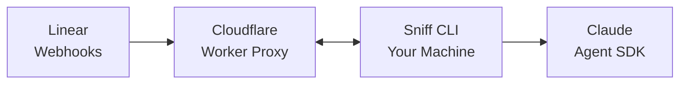

# What is Sniff?

Sniff is a self-hosted AI agent framework for Linear. Define your agents in YAML, deploy a Cloudflare Worker proxy, and let AI handle your issue triage, research, and coding tasks.

Like Docker Compose for AI agents.

## Why Sniff?

- **Self-hosted** - Run on your infrastructure. No vendor lock-in, no data leaving your network
- **Declarative** - Define agents in YAML. Version control your configuration
- **Powerful** - Built on Claude Agent SDK with full access to file tools
- **Extensible** - MCP server integrations, hooks for lifecycle events, sandbox isolation

## How It Works



1. **CLI connects** → Establishes WebSocket connection to cloud proxy
2. **Linear sends webhook** → Issue agent assigned or mentioned
3. **Proxy forwards** → Webhook delivered to CLI through WebSocket
4. **Agent runs** → Claude Agent SDK processes with your system prompt and tools
5. **Response posted** → Agent replies in Linear

No tunnels or port forwarding needed - CLI connects outbound to the proxy.

## What Can Agents Do?

With Sniff and Claude Agent SDK, your agents can:

- **Write code** - Create, edit, and refactor files in your codebase
- **Run commands** - Execute builds, tests, and git operations
- **Research questions** - Search and analyze code, read documentation
- **Triage issues** - Classify type, set priority, suggest labels
- **Analyze bugs** - Read stack traces, find root causes, propose fixes

## Example Configuration

```yaml
version: "2.0"

agents:
  - id: engineer
    name: Engineer
    label: agent
    systemPrompt: |
      You are a software engineer. Help with coding tasks,
      bug fixes, and code reviews. Write clean, tested code.
    runner:
      claude:
        allowedTools:
          - Read
          - Write
          - Edit
          - Glob
          - Grep
          - Bash
        permissionMode: acceptEdits
        maxTurns: 50
```

## Get Started

Ready to deploy your first agent?

<Card title="Quickstart" icon="rocket" href="/quickstart">
  Deploy an agent in 5 minutes
</Card>
